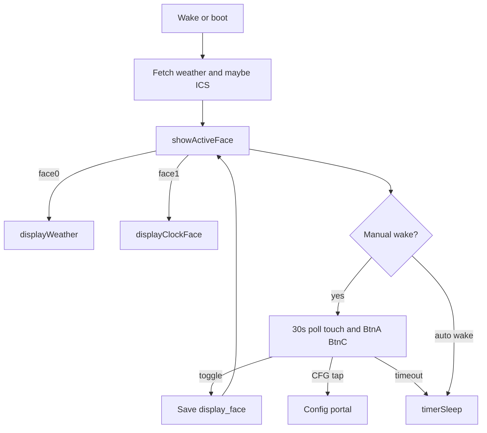

# Dual dashboard faces (rotary toggle)

## Locked UX

- **Face 0:** existing `displayWeather()` (unchanged layout).
- **Face 1:** left clock+date / weather summary; right enlarged calendar.
- **Toggle:** either `M5.BtnA` (G37) or `M5.BtnC` (G39) cycles `0 ↔ 1` during the manual-wake 30s wait only.
- **On toggle:** save prefs, redraw via `showActiveFace()`, **reset** the 30s timer so CFG remains reachable.
- **Persist:** Preferences key `display_face` (`0`|`1`), default `0`.
- **Auto RTC wake:** no button polling; `setup()` still fetches data and draws the saved face, then sleeps.
- **Clock on Face 1:** static snapshot at draw time (not live-ticking).
- **No** on-screen face indicator.
- Portal: BtnA still exits config only inside the portal; face toggle never runs there.



---

## Face 1 geometry (960×540)

Constants in [`src/constants.h`](src/constants.h):

| Constant | Value | Role |
|----------|-------|------|
| `FACE1_MARGIN` | 14 | Outer margin (align with existing panel border) |
| `FACE1_GAP` | 12 | Gap between left/right and top/bottom left |
| `FACE1_LEFT_W` | 440 | Left column width |
| `FACE1_RIGHT_W` | `SCREEN_WIDTH - FACE1_MARGIN*2 - FACE1_LEFT_W - FACE1_GAP` (= ~480) | Right calendar column |
| `FACE1_TOP_H` | 250 | Clock + date panel height |
| `FACE1_BOTTOM_H` | `SCREEN_HEIGHT - FACE1_MARGIN*2 - FACE1_TOP_H - FACE1_GAP` (= ~250) | Weather summary height |

Regions:
- Clock panel: `(FACE1_MARGIN, FACE1_MARGIN, FACE1_LEFT_W, FACE1_TOP_H)`
- Weather panel: `(FACE1_MARGIN, FACE1_MARGIN+FACE1_TOP_H+FACE1_GAP, FACE1_LEFT_W, FACE1_BOTTOM_H)`
- Calendar panel: `(FACE1_MARGIN+FACE1_LEFT_W+FACE1_GAP, FACE1_MARGIN, FACE1_RIGHT_W, SCREEN_HEIGHT-FACE1_MARGIN*2)`

Content:
- **Clock:** `HH:MM` with `FreeSansBold24pt7b` + large `setTextSize` (tune to fit); date line below (`Weekday DD Mon YYYY` via `resolveCalendarDate` / `getLocalTime` + `monthNameEnglish`).
- **Weather:** large temp + degree, 64px icon, condition text, feels-like / today high-low — compact reuse of Face 0 current-weather fields (new helper `drawFace1WeatherSummary`, not full-width `drawCurrentConditions`).
- **Calendar:** title `MMMM YYYY` or `Google Calendar`; body calls existing `drawMonthCalendar` / `drawCalendarEvents` with the large right content rect. Honor `calendarMode`. Keep `[CFG]` in bottom-right of full screen.

Shared sprite path: same as Face 0 (`setColorDepth(8)`, full-screen sprite, `pushSprite`, `display()`).

---

## File-by-file changes

| File | Change |
|------|--------|
| [`src/constants.h`](src/constants.h) | Face 1 geometry constants; `DEFAULT_DISPLAY_FACE 0` |
| [`src/main.cpp`](src/main.cpp) | Global `int displayFace`; load/save `display_face`; after fetch call `showActiveFace()`; in 30s wait poll BtnA/BtnC → toggle, prefs write, redraw, reset timer |
| [`src/display.h`](src/display.h) | `showActiveFace()`, `displayClockFace()`, `drawFace1WeatherSummary(...)` |
| [`src/display.cpp`](src/display.cpp) | Implement Face 1 + router; leave `displayWeather()` body as-is |
| [`src/config.cpp`](src/config.cpp) | No portal UI for face (button-only); optionally load `display_face` inside `loadPreferences` if cleaner — prefer load in `main`/`showActiveFace` path for minimal portal churn |
| [`README.md`](README.md) | Rotary up/down switches faces in post-reset window; face persists; clock is snapshot; buttons ignored in deep sleep |

---

## Interaction loop (main.cpp)

Inside the existing manual-wake `while` (alongside CFG touch):

```cpp
M5.update();
if (M5.BtnA.wasPressed() || M5.BtnC.wasPressed()) {
    displayFace = (displayFace == 0) ? 1 : 0;
    preferences.begin("weather", false);
    preferences.putInt("display_face", displayFace);
    preferences.end();
    showActiveFace();
    startWait = millis();  // reset 30s window
}
```

Load at boot (with calendar mode prefs):

```cpp
displayFace = preferences.getInt("display_face", DEFAULT_DISPLAY_FACE);
if (displayFace != 0 && displayFace != 1) displayFace = 0;
```

Replace `displayWeather()` after successful weather fetch with `showActiveFace()`.

---

## Risks

1. Buttons only work in the 30s wake window — document in README.
2. Full e-ink redraw per toggle — acceptable.
3. Large clock font sizing may need one device tweak pass.
4. BtnA dual-use is context-safe (portal vs wait loop).

---

## Test checklist

- [ ] Boot Face 0 by default
- [ ] Reset → within 30s, BtnA and BtnC each toggle faces and redraw
- [ ] Toggle resets wait; `[CFG]` still opens portal
- [ ] Face choice survives sleep + next wake redraw
- [ ] Face 1 month mode: larger grid, today inverted
- [ ] Face 1 google mode: event list in right panel
- [ ] Portal BtnA still exits without toggling face
- [ ] Auto wake skips button wait, draws saved face, sleeps

---

## Effort

About **3–5 hours**: Face 1 layout (~2h), wiring/prefs/toggle (~1h), README + device layout tune (~1–2h).
