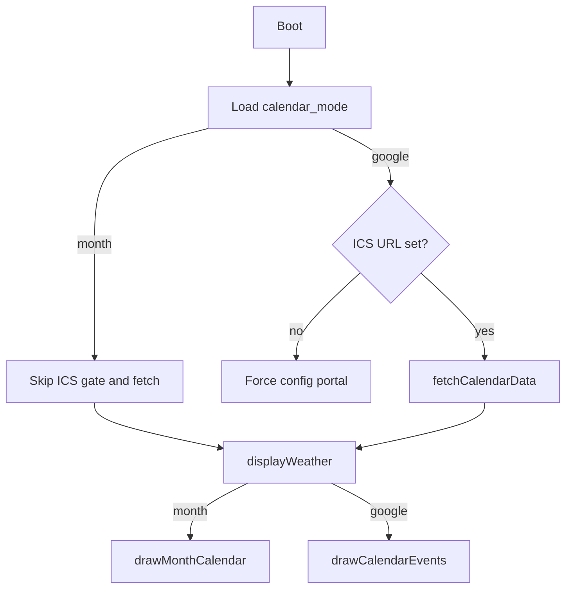

# Calendar panel mode: Google vs Month grid

## Locked UX decisions

- **Default mode:** `month` — new devices show a month grid without requiring an ICS URL. Existing devices with a saved ICS keep it; users switch to Google in the portal when they want events.
- **Week starts Sunday**, header labels: `S M T W T F S`.
- **Out-of-month cells:** blank (no gray numbers).
- **Today date source:** prefer `currentWeather.localDateYmd` when length is 8 (same as [calendar_api.cpp](src/calendar_api.cpp)); else fall back to `getLocalTime()`.
- **Modes are exclusive:** month mode never fetches or lists Google events.

---

## Prefs schema and validation

| Key | Values | Default |
|-----|--------|---------|
| `calendar_mode` | `"month"` \| `"google"` | `"month"` |
| `calendar_ics` | URL string | unchanged; required only when mode is google |

**Portal**
- Section rename to **Calendar Panel**; select: Month Calendar / Google Calendar.
- ICS field shown only when Google is selected (JS toggle `display` + remove HTML `required` when month).
- `validateForm()`: require ICS only if mode is `google`.
- `/save`: write `calendar_mode`; if google and ICS empty → 400; if month, allow empty ICS.
- Current Settings line: `Calendar: Month Calendar` or `Calendar: Google Calendar`.

**Boot gate** ([src/main.cpp](src/main.cpp))
- Replace “ICS missing → portal” with: open portal for missing ICS **only when** `calendar_mode == "google"`.
- After weather fetch: call `fetchCalendarData` **only** in google mode.

Expose mode via a global (e.g. `String calendarMode` or `bool useMonthCalendar`) set in `loadPreferences()` in [src/config.cpp](src/config.cpp), same pattern as `useCelsius`.

---

## File-by-file changes

| File | Change |
|------|--------|
| [src/constants.h](src/constants.h) | Month-grid layout constants (weekday header height, min cell size notes) |
| [src/config.cpp](src/config.cpp) | Mode select, conditional ICS UI/validation, load/save `calendar_mode`, set global |
| [src/main.cpp](src/main.cpp) | Conditional ICS gate + conditional `fetchCalendarData` |
| [src/display.h](src/display.h) | Declare `drawMonthCalendar(...)` |
| [src/display.cpp](src/display.cpp) | Implement grid; branch in `displayWeather()` |
| [src/utils.h](src/utils.h) / [src/utils.cpp](src/utils.cpp) | Small helpers: resolve calendar `tm` from `localDateYmd` or RTC; days-in-month |
| [README.md](README.md) | One short note on Calendar Panel mode + today highlight |

No changes to weather APIs or Next 3 Days layout geometry (`calendarW = 360`, `dailyH = 180`).

---

## `drawMonthCalendar` algorithm

Signature: `void drawMonthCalendar(int x, int y, int dx, int dy);` — `y` is content top below the panel title line (same as `drawCalendarEvents`).

1. Resolve year/month/day via helper (localDateYmd or `getLocalTime`).
2. Panel title is drawn by `displayWeather()` as English `MMMM YYYY` (e.g. `August 2026`) using a static month-name table.
3. Inside content rect `(x,y,dx,dy)`:
   - Weekday header row height ~16–18px: centered `S M T W T F S` at `textSize` 1.
   - Remaining height split into **6** equal week rows (always 6 for stable layout).
   - `cellW = dx / 7`, `cellH = (dy - headerH) / 6`.
4. `firstWeekday = weekday of day 1` with Sunday=0 (`tm_wday`).
5. `daysInMonth` via standard month lengths + leap year for February.
6. For day `d = 1..daysInMonth`, cell index `i = firstWeekday + d - 1`, row=`i/7`, col=`i%7`.
7. If `d == todayDay`: `fillRect` black for that cell; `setTextColor(TFT_WHITE, TFT_BLACK)`; draw number centered; restore black-on-white.
8. Else: black number centered in cell.
9. Draw 1px internal grid lines (vertical between cols, horizontal between week rows) in black — keep light so today fill still reads clearly (draw lines after fill, or inset fill by 1px).

Out-of-month leading/trailing slots: leave empty.

---

## Layout math (~360 × 145 content)

- Header row: ~18px → body ~127px → `cellH ≈ 21px` for 6 rows.
- `cellW ≈ 51px`.
- Day numbers: `setTextSize(1)` (or 2 if it still fits); `TC_DATUM` / `MC_DATUM` for centering.
- If text clips on device, drop to size 1 and reduce header to 14px — no panel width change.

---

## Risks

1. **Tight vertical space** — fixed 6-row layout; verify readability on Paper e-ink.
2. **Date mismatch** — weather local date preferred so “today” matches forecast timezone; RTC fallback if weather missing.
3. **Missing pref** — default `month` so empty NVS does not trap users in ICS-required portal.
4. **Google mode regression** — ICS still required; event list unchanged.

---

## Test checklist

- [ ] Fresh device / cleared prefs → month grid, no ICS portal force
- [ ] Switch to Google without ICS → portal validation error / boot gate
- [ ] Google with valid ICS → event list as before
- [ ] Switch back to month → grid, no fetch
- [ ] Today cell black with white number; other days black on white
- [ ] 6-week month (e.g. Aug 2026-style) still fits
- [ ] Leap year February; month boundary after sleep overnight
- [ ] Blank out-of-month cells; Sunday-first header

---

## Effort

About **2–4 hours**: portal/JS (~1h), drawMonthCalendar + date helpers (~1–1.5h), main/prefs wiring (~0.5h), README + device check (~0.5–1h).
