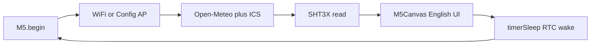

# Port to M5Paper v1.1 (English only)

## Decisions (locked)

- **Target:** Paper v1.1 only. Replace `[env:PaperS3]` with `[env:Paper]`; no dual-board `#ifdef`s.
- **Libraries:** Keep **M5Unified + M5GFX** (do not use deprecated M5EPD). Add **M5Unit-ENV** for onboard SHT30 ([official Paper SHT30 docs](https://docs.m5stack.com/en/arduino/m5paper/sht30)).
- **Branding:** Rename app to `PaperWeather-Calendar` (AP SSID / splash / panel title).
- **Sleep:** Use `M5.Power.timerSleep(seconds)` (sets RTC alarm + powers down). Skip all IMU calls. Document that USB-powered units will not fully power off.
- **Canvas:** Use `setColorDepth(8)` before full-screen sprite (IT8951 is grayscale; halves PSRAM vs current 16-bit).

Effort: ~4–8 hours focused work (mostly English strip + env bring-up + device validation).



---

## A. PlatformIO env

Replace `[env:PaperS3]` in [`platformio.ini`](platformio.ini) with:

```ini
[env:Paper]
platform = espressif32
board = m5stack-paper
framework = arduino
monitor_speed = 115200
upload_speed = 1500000
board_build.partitions = default_16MB.csv
board_upload.flash_size = 16MB
board_upload.maximum_size = 16777216

lib_deps =
    m5stack/M5Unified @ 0.2.7
    m5stack/M5GFX @ 0.2.9
    m5stack/M5Unit-ENV @ ^1.2.1
    bblanchon/ArduinoJson @ ^7.2.1

build_flags =
    -DBOARD_HAS_PSRAM
    -DARDUINO_M5STACK_Paper
    -DCONFIG_ARDUINO_LOOP_STACK_SIZE=32768
    -DCONFIG_SPIRAM_USE_MALLOC=1
```

**Do not carry over:** `-DESP32S3`, `ARDUINO_USB_CDC_ON_BOOT`, `ARDUINO_USB_MODE`, `qio_opi`.

**Fallback if `board = m5stack-paper` is missing locally:** use `board = m5stack-fire` with the same `build_flags` / flash / partitions (same approach as community Paper setups), or switch `platform` to pioarduino’s espressif32 zip that ships the Paper board JSON. Try `m5stack-paper` first during implement; only switch if PlatformIO errors on unknown board.

Build command: `pio run -e Paper` / `pio run -e Paper --target upload`.

---

## B. File-by-file changes

| File | Changes |
|------|---------|
| [`platformio.ini`](platformio.ini) | Replace PaperS3 env as above; add M5Unit-ENV |
| [`src/constants.h`](src/constants.h) | `APP_NAME` → `PaperWeather-Calendar`; delete `LANG_BUTTON_*` |
| [`src/main.cpp`](src/main.cpp) | Remove Chinese globals + `toggleDisplayLanguage`; CFG-only touch wait; rewrite `enterDeepSleep` to display sleep + `M5.Power.timerSleep`; canvas init `setColorDepth(8)`; keep `setRotation(1)` |
| [`src/utils.cpp`](src/utils.cpp) / [`utils.h`](src/utils.h) | SHT3X sensors; delete Chinese replacement tables / `localize*`; convert °C→°F when `!useCelsius` |
| [`src/display.cpp`](src/display.cpp) | English-only labels; delete `labelText`, Chinese fonts, mixed-glyph helpers, lang indicator; title `"M5Paper"`; `setColorDepth(8)` before `createSprite` |
| [`src/config.cpp`](src/config.cpp) | Remove display-language portal UI + prefs; simplify `loadPreferences`; keep `M5.BtnA` exit (rotary up) |
| [`src/weather_api.cpp`](src/weather_api.cpp) | Geocode `language=en` only; drop `localizeCityName` / `useChineseDisplay` |
| [`src/calendar_api.cpp`](src/calendar_api.cpp) | Stop calling `localizeDisplayText` |
| [`README.md`](README.md) | Short Paper v1.1 build/flash + English-only note; trim Chinese feature docs |

Out of scope unless trivial: deleting CN/ZH PNGs, rewriting CHANGELOG history.

---

## C. English-only removal checklist

**Delete**

- Globals: `useChineseDisplay`, `useTraditionalChinese`, `toggleDisplayLanguage()`
- Prefs key: `display_lang` (stop read/write)
- Portal: Display Language `<select>`, help text, current-settings line
- Touch: bottom-left `LANG_BUTTON_*` hit test + Serial prompts
- Display: `labelText*`, `efontCN`/`efontTW`, `[繁中]`/`[简中]`/`[EN]` indicator, `getDisplayWeatherConditionText` Chinese branches, TW/CN day names, `*MixedChinese` / `fontForGlyph` / `primaryChineseFont` / `fallbackChineseFont`
- Utils: `CHINESE_TEXT_REPLACEMENTS`, `localizeDisplayText`, `localizeCityName`
- Config Chinese re-geocode block in `loadPreferences`

**Hardcode English at former `labelText` sites**

- Panel titles: Current Weather, Next 8 Hours, Next 3 Days, Google Calendar
- Detail labels: Feels, Today, Humidity, Wind, Rain, Sunrise, Sunset
- Calendar: Calendar sync failed, No events today
- `[CFG]` at `SCREEN_WIDTH - 50`

**Keep**

- `getWeatherConditionText`, `getDisplayDateLabel` (English days only), `fitText` + `drawString`, geocode `language=en`

---

## D. Hardware adaptations

### Sensors ([`utils.cpp`](src/utils.cpp))

Per [m5-docs Paper SHT30](https://docs.m5stack.com/en/arduino/m5paper/sht30):

```cpp
#include <M5UnitENV.h>
static SHT3X sht3x;
static bool shtReady = false;

// once after M5.begin():
shtReady = sht3x.begin(&Wire, SHT3X_I2C_ADDR, 21, 22, 400000U);

// readInternalTemperature / Humidity:
sht3x.update();
// temp: sht3x.cTemp (convert to F if !useCelsius)
// humidity: sht3x.humidity
// on failure: SENSOR_ERROR_VALUE → weather fallback in draw path
```

Remove `M5.Imu.*` entirely.

### Sleep ([`main.cpp`](src/main.cpp))

```cpp
M5.Display.sleep();
M5.Display.waitDisplay();
M5.Power.timerSleep((int)(sleepTimeMs / 1000));
```

No IMU. Note in README: validate wake on **battery**; USB may prevent power-off.

### Buttons

Keep `M5.BtnA.wasPressed()` to leave config portal (rotary **up**). Document: wheel press = `BtnB`, down = `BtnC`. No API change required.

### Display / canvas

- Keep `SCREEN_WIDTH 960`, `SCREEN_HEIGHT 540`, `setRotation(1)`.
- `canvas.setColorDepth(8)` before `createSprite(960, 540)`.
- Keep `M5.Display.display()` after push; optionally `setEpdMode(epd_quality)` once at boot if refresh looks poor (only if needed on device).

---

## E. Risks (ranked)

1. **PlatformIO board JSON missing** — mitigated by fire+flags or pioarduino fallback.
2. **Full-screen sprite alloc** — mitigated by 8-bit depth + `BOARD_HAS_PSRAM`; fail path already logs and returns.
3. **RTC / `timerSleep` wake** — Paper power quirks on USB; must test on battery.
4. **SHT30 init** — Wire conflict unlikely after `M5.begin()`; fall back to weather values if begin fails.
5. **Binary size** — English-only removes efont usage → should shrink vs current S3 Chinese build.
6. **Temp unit mismatch** — SHT30 is °C; must convert when UI is Fahrenheit (fix in reader).

---

## F. Verification checklist

- [ ] `pio run -e Paper` compiles
- [ ] Flash to M5Paper v1.1
- [ ] Splash shows new app name
- [ ] WiFi connect or config AP `PaperWeather-Calendar` / `configure`
- [ ] Weather + calendar English dashboard renders (960×540 landscape)
- [ ] Bottom-right `[CFG]` touch opens portal; no language control or Chinese strings
- [ ] No bottom-left language toggle behavior
- [ ] SHT30 temp/humidity shown when sensor OK; weather fallback when not
- [ ] Battery % and WiFi quality draw
- [ ] Sleep → RTC wake at day/night intervals (battery preferred)
- [ ] Rotary up exits config portal

---

## G. Effort and scope note

| Area | Estimate |
|------|----------|
| PlatformIO env + first compile | 0.5–1.5 h |
| English strip across display/config/main/utils/APIs | 1.5–3 h |
| SHT30 + sleep + canvas depth | 0.5–1 h |
| Device bring-up / sleep wake debug | 1–2 h |
| README trim | 0.5 h |

**Paper-only** is the right call here: English-only + classic ESP32 flags conflict with keeping a clean PaperS3 env without `#ifdef` sprawl.