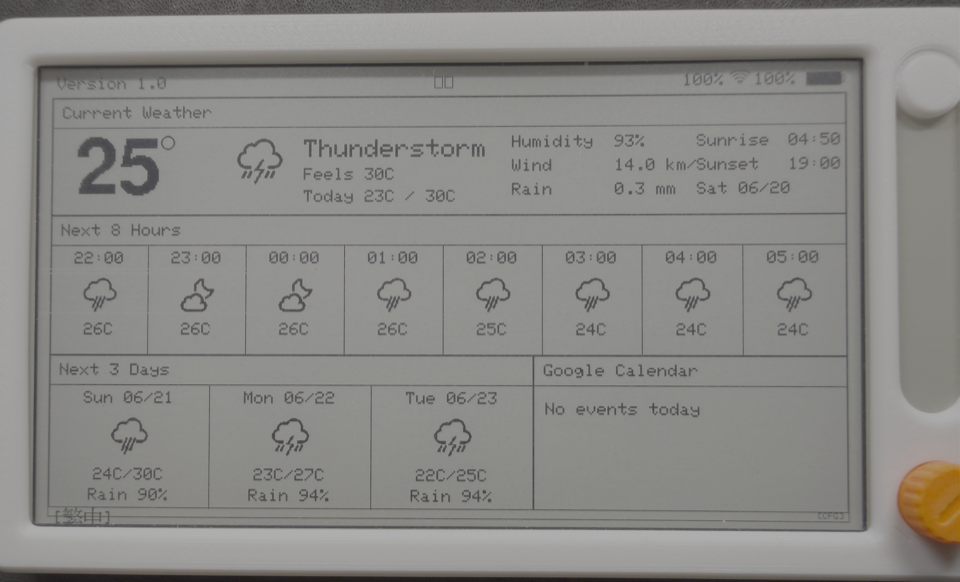

# PaperS3Weather-Calendar



PaperS3Weather-Calendar is a weather and Google Calendar dashboard for the M5Paper S3 e-ink display. It shows current weather, the next 8 hours, the next 3 days, and today's calendar events on one screen, with English or Chinese display labels selected from the setup portal.

Firmware is built automatically with GitHub Actions. Download the latest `firmware.bin` from the project's [GitHub Releases](https://github.com/gemmayclee-droid/PaperS3Weather-Calendar/releases).

[](https://www.arduino.cc/)
[](https://platformio.org/)
[](https://www.espressif.com/)

## Features

- **Single-screen dashboard**: Current weather, next 8 hours, next 3 days, and Google Calendar events.
- **Current weather**: Large temperature, weather condition, feels-like temperature, daily high/low, humidity, wind, rain, sunrise, sunset, and date.
- **Next 8 hours**: Hourly time, weather icon, and temperature, starting two hours from the current local weather time.
- **Next 3 days**: Date, weather icon, high/low temperature, and rain probability.
- **Google Calendar**: Shows today's events from a configured Google Calendar ICS URL.
- **Display language**: English by default, with optional Chinese labels and localized city names from the setup portal or the main-screen language button.
- **Web setup portal**: Configure WiFi, location, calendar ICS URL, temperature unit, language, refresh intervals, and night mode.
- **Automatic setup prompt**: Opens setup when WiFi is missing, WiFi fails, or the calendar ICS URL has not been configured.
- **Power saving**: Deep sleep between updates, with separate day/night refresh intervals.
- **GitHub release builds**: Every main-branch firmware build is published as a downloadable `firmware.bin`.

## Hardware Requirements

- **M5Paper S3** device (4.7" e-ink display, 960x540 resolution)
- **USB-C cable** for programming and power
- **WiFi connection** for weather data

## Install Firmware

### Option A: Download Prebuilt Firmware

1. Open the [Releases page](https://github.com/gemmayclee-droid/PaperS3Weather-Calendar/releases).
2. Download the latest `firmware.bin`.
3. Flash it to your M5Paper S3 with your preferred ESP32 flashing tool.

### Option B: Build with PlatformIO

```bash
git clone https://github.com/gemmayclee-droid/PaperS3Weather-Calendar.git
cd PaperS3Weather-Calendar
pio run -e PaperS3
pio run -e PaperS3 --target upload
```

## Attribution

This project is based on [Bastelschlumpf's M5PaperWeather](https://github.com/Bastelschlumpf/M5PaperWeather), adapted for the M5Paper S3 hardware with significant modifications for the new platform.

### Key Changes from Original

- **Hardware Platform**: Migrated from M5Paper (EPD) to M5Paper S3 (S3-based)
- **Library Migration**: Switched from M5EPD to M5Unified library for M5Paper S3 compatibility
- **Weather API**: Replaced OpenWeatherMap with Open-Meteo API (no API key required)
- **Location System**: Added city-based geocoding with automatic coordinate lookup
- **Temperature Units**: Implemented Celsius/Fahrenheit toggle
- **Night Mode**: Configurable reduced refresh rate for battery efficiency
- **Display Design**: Redesigned Current Conditions panel with TrueType fonts
- **Power Management**: Enhanced deep sleep implementation
- **Configuration**: Web-based WiFi and settings configuration portal

## First Setup

After first boot, the device starts the setup portal if required.

1. Connect your phone or computer to WiFi network `PaperS3Weather-Calendar`.
2. Use password `configure`.
3. Open `http://192.168.4.1`.
4. Enter the required settings:
   - **WiFi SSID**: Your 2.4 GHz WiFi network.
   - **WiFi Password**: Your WiFi password.
   - **City Name**: Used for automatic coordinate lookup.
   - **Google Calendar ICS URL**: Required for today's events.
   - **Temperature Unit**: Fahrenheit or Celsius.
   - **Display Language**: English or Chinese.
   - **Refresh / Night Mode**: Optional power-saving settings.
5. Click **Save & Restart**.

## Google Calendar ICS URL

The calendar panel reads an iCal/ICS feed. In Google Calendar:

1. Open Google Calendar in a browser.
2. Open the calendar's settings.
3. Find **Integrate calendar**.
4. Copy the public or secret iCal address.
5. Paste that URL into the setup portal's **Google Calendar ICS URL** field.

The device accepts `https://...` and converts `webcal://...` URLs to HTTPS automatically.

Calendar matching uses the weather location's local date from Open-Meteo. The parser displays up to three events whose `DTSTART` is today and supports simple daily/weekly `RRULE` recurring events. Long multi-day events may need future parser improvements.

## Display Language

The setup portal includes a **Display Language** option:

- **English**: Default.
- **Chinese**: Main dashboard labels use the built-in M5GFX Chinese font.

The main screen also has a language toggle in the bottom-left corner. After a manual reset or power-on, tap `[中文]` to switch from English to Chinese, or `[EN]` to switch back to English. The setting is saved immediately.

Chinese labels currently use simplified Chinese strings because they are the safest fit for the built-in font. Traditional Chinese typography may require adding an external font asset.

## Developer Workflow

```bash
git clone https://github.com/gemmayclee-droid/PaperS3Weather-Calendar.git
cd PaperS3Weather-Calendar
pio run -e PaperS3
pio run -e PaperS3 --target upload
pio device monitor
```

## Configuration

### WiFi Configuration Portal

**How to Access**:
1. **Press the reset button** on your M5Paper S3 device
2. Device wakes and displays weather
3. **Within 30 seconds**, tap the **[CFG]** button in the bottom-right corner of the screen
4. Configuration portal opens automatically

The same 30-second interaction window also enables the bottom-left language toggle button.

**Automatic Portal Access**:
- First boot (no WiFi configured)
- Connection fails to saved network
- Calendar ICS URL is missing

**Portal Details**:
- Network: `PaperS3Weather-Calendar`
- Password: `configure`
- URL: `http://192.168.4.1`

**Note**: Automatic weather updates (every 10-60 minutes) do NOT show the 30-second config window - they immediately refresh and sleep. This saves battery. The config window only appears after manual reset button press.

### Location Settings

Two methods to set location:

1. **City Name** (Recommended):
   - Enter your city name (e.g., "London", "Sydney", "New York")
   - Leave latitude/longitude fields blank
   - Coordinates are looked up automatically AFTER WiFi connection
   - Simpler and more user-friendly
   - Examples: "Tokyo", "Paris", "Auckland", "San Francisco"

2. **Manual Coordinates** (Advanced):
   - Enter exact latitude and longitude in decimal degrees
   - Useful for specific locations not found by city search
   - Format: Decimal degrees (e.g., -36.8485, 174.7633)
   - Overrides city name if provided

**How City Geocoding Works:**

The configuration portal runs in WiFi Access Point mode (no internet access), so city coordinates cannot be looked up during configuration. Instead:

1. Enter your city name in the config portal
2. Save settings and device restarts
3. Device connects to your WiFi (now has internet)
4. Coordinates are automatically geocoded from city name
5. Coordinates are saved for future use

This means you won't see geocoding errors in the config portal - they only occur after WiFi connection if the city name can't be found.

### Temperature Unit

Choose between Fahrenheit (default) or Celsius via dropdown menu in configuration portal. This affects all temperature displays including current conditions and forecasts.

### Night Mode

**Enabled by default** via checkbox. When enabled, night mode reduces refresh frequency from 10 minutes to 60 minutes between 10pm and 5am, significantly extending battery life for overnight operation.

## Development

### Project Structure

```
PaperS3Weather-Calendar/
├── src/
│   ├── main.cpp           # Main application entry point
│   ├── constants.h        # Configuration constants and defines
│   ├── utils.h/cpp        # Helper functions (temp, time, weather)
│   ├── weather_api.h/cpp  # Open-Meteo API communication
│   ├── config.h/cpp       # WiFi setup and web portal
│   ├── calendar_api.h/cpp # Google Calendar ICS fetching and parsing
│   ├── display.h/cpp      # Display rendering functions
│   └── Icons.h            # Weather icon bitmap data
├── platformio.ini         # PlatformIO configuration
├── CHANGELOG.md           # Version history
├── README.md              # This file
└── LICENSE                # MIT License
```

### Customizing Refresh Intervals and Night Mode

**Via Web Interface (Recommended)**:

1. Press the reset button on your M5Paper S3
2. Within 30 seconds, tap the [CFG] button in bottom-right corner of display
3. Connect to WiFi: `PaperS3Weather-Calendar` (password: `configure`)
4. Navigate to: `http://192.168.4.1`
5. Set custom refresh intervals:
   - **Day Time**: 5-120 minutes (how often to update during the day)
   - **Night Time**: 15-240 minutes (how often to update at night)
6. Set custom night mode hours:
   - **Start Hour**: 0-23 (when night mode begins, e.g., 22 = 10pm)
   - **End Hour**: 0-23 (when night mode ends, e.g., 5 = 5am)
7. Save and restart

**Via Code** (for advanced users):

Edit `src/constants.h`:

```cpp
#define REFRESH_INTERVAL_DAY_MS 600000      // 10 minutes (default)
#define REFRESH_INTERVAL_NIGHT_MS 3600000   // 60 minutes (default)
#define NIGHT_START_HOUR 22  // 10pm (default)
#define NIGHT_END_HOUR 5     // 5am (default)
```

These are fallback defaults. User preferences saved via web interface take precedence.

### Modifying Display Layout

The display uses Bastelschlumpf's panel-based layout:

- **Top Section**: current weather details
- **Middle Section**: 8 hourly forecast columns
- **Bottom Section**: 3-day forecast and Google Calendar events

Panel positions are defined in `displayWeather()` function in `src/display.cpp`. Coordinates use absolute positioning for precise layout control.

### Adding Features

The code is modular and well-structured for extensions:

- **New weather data**: Modify `WeatherData` struct and `fetchWeatherData()`
- **Additional panels**: Add new drawing calls in `displayWeather()`
- **Custom panels**: Create new `draw*()` functions following existing patterns
- **Different APIs**: Replace Open-Meteo calls in `fetchWeatherData()`

## Troubleshooting

### Device Not Connecting to WiFi

**Problem**: Configuration portal doesn't appear or connection fails

**Solutions**:
- Ensure WiFi network is 2.4GHz (M5Paper S3 doesn't support 5GHz)
- Check WiFi password is correct (case-sensitive)
- Move device closer to router during initial setup
- Restart device by pressing power button

**Debug**:
```bash
pio device monitor --baud 115200
```
Watch serial output for connection errors.

### Display Not Updating

**Problem**: Weather display shows old data or "Failed to fetch weather"

**Solutions**:
- Verify internet connection is working
- Check serial monitor for API errors
- Confirm location coordinates are valid
- Open-Meteo API may be temporarily unavailable (retry in a few minutes)

**Manual Test**:
Visit in browser: `https://api.open-meteo.com/v1/forecast?latitude=40.7128&longitude=-74.0060&current=temperature_2m`
(Replace coordinates with your location)

### Upload Fails

**Problem**: PlatformIO can't upload to device

**Solutions**:
- Press and hold power button to ensure device is on
- Try different USB cable (some are charge-only)
- Try different USB port on computer
- Install/update USB drivers for your operating system
- Check device is recognized: `pio device list`

### Serial Monitor Shows Gibberish

**Problem**: Serial output is unreadable

**Solution**:
Ensure baud rate is 115200:
```bash
pio device monitor --baud 115200
```

### Battery Drains Quickly

**Problem**: Device battery doesn't last long

**Solutions**:
- Enable Night Mode in configuration
- Increase refresh intervals in the setup portal
- Check deep sleep is working (serial monitor should show sleep messages)
- Verify WiFi signal is strong (weak signal increases power consumption)

### Configuration Portal Won't Open

**Problem**: Can't access `192.168.4.1`

**Solutions**:
- Ensure you're connected to `PaperS3Weather-Calendar` WiFi network
- Disable mobile data on phone (forces use of WiFi)
- Try `http://` explicitly: `http://192.168.4.1`
- Clear browser cache or try different browser
- Check device serial output for AP startup messages

### Weather Icons Not Displaying

**Problem**: Weather icons appear as blank squares

**Solution**:
- Icons.h may be corrupt - re-download project
- Check sufficient flash memory during build
- Verify `Icons.h` is in `src/` directory

### City Name Not Found / Geocoding Failed

**Problem**: Serial monitor shows "Geocoding failed" or "could not find city use lat long"

**Solutions**:
- Try city name without state/country (e.g., "Portland" not "Portland, Oregon")
- Try adding country (e.g., "Portland USA" or "Portland UK")
- Use major city nearby if your location is small
- Switch to manual coordinates as fallback
- Check internet connection is working (geocoding requires internet)

**How to see geocoding results**:
```bash
pio device monitor --baud 115200
```
Look for lines like:
```
Geocoding city: Tokyo
Found: Tokyo, Japan at 35.6895, 139.6917
```

**Manual Override**:
If geocoding consistently fails, enter manual coordinates in the config portal. You can find coordinates by:
1. Searching "[your city] coordinates" in Google
2. Using [latlong.net](https://www.latlong.net/)
3. Right-clicking location in Google Maps → "What's here?"

### Wrong Time Zone

**Problem**: Times displayed don't match local time

**Solution**:
Edit NTP timezone in `src/main.cpp` setup():
```cpp
configTime(timezone_offset_seconds, 0, "pool.ntp.org", "time.nist.gov");
```

Example offsets:
- GMT+0: `0`
- EST (GMT-5): `-5 * 3600`
- PST (GMT-8): `-8 * 3600`
- AEST (GMT+10): `10 * 3600`

Or use Open-Meteo's auto-timezone (default).

## API Information

This project uses the [Open-Meteo API](https://open-meteo.com/), a free weather API that requires no API key. The API provides:

- Current weather conditions
- Hourly forecasts
- Daily forecasts
- Sunrise/sunset times
- Multiple weather parameters

**API Limits**: Open-Meteo is free for non-commercial use with reasonable request limits. The default refresh interval (10 minutes) is well within limits.

## Power Consumption

**Typical Battery Life** (with 1150mAh battery):

- **Default Settings** (10min/60min refresh): ~7-10 days
- **Aggressive Mode** (5min refresh): ~3-5 days
- **Power Saver Mode** (30min/120min refresh): ~14-21 days

Deep sleep current draw: ~0.17mA
Active (fetching/displaying): ~150-200mA for 10-15 seconds

## License

MIT License

Copyright (c) 2025

Permission is hereby granted, free of charge, to any person obtaining a copy
of this software and associated documentation files (the "Software"), to deal
in the Software without restriction, including without limitation the rights
to use, copy, modify, merge, publish, distribute, sublicense, and/or sell
copies of the Software, and to permit persons to whom the Software is
furnished to do so, subject to the following conditions:

The above copyright notice and this permission notice shall be included in all
copies or substantial portions of the Software.

THE SOFTWARE IS PROVIDED "AS IS", WITHOUT WARRANTY OF ANY KIND, EXPRESS OR
IMPLIED, INCLUDING BUT NOT LIMITED TO THE WARRANTIES OF MERCHANTABILITY,
FITNESS FOR A PARTICULAR PURPOSE AND NONINFRINGEMENT. IN NO EVENT SHALL THE
AUTHORS OR COPYRIGHT HOLDERS BE LIABLE FOR ANY CLAIM, DAMAGES OR OTHER
LIABILITY, WHETHER IN AN ACTION OF CONTRACT, TORT OR OTHERWISE, ARISING FROM,
OUT OF OR IN CONNECTION WITH THE SOFTWARE OR THE USE OR OTHER DEALINGS IN THE
SOFTWARE.

## Acknowledgments

- **Original Design**: [Bastelschlumpf](https://github.com/Bastelschlumpf) for the excellent M5PaperWeather project
- **Weather Data**: [Open-Meteo](https://open-meteo.com/) for providing free, no-API-key weather data
- **Hardware**: [M5Stack](https://m5stack.com/) for the M5Paper S3 device and M5Unified library
- **Icons**: Weather icons from the original M5PaperWeather project

## Support

For issues, questions, or contributions:
- Open an issue on GitHub
- Check existing issues for similar problems
- Include serial monitor output for debugging

---

**Enjoy your PaperS3Weather-Calendar station!**
