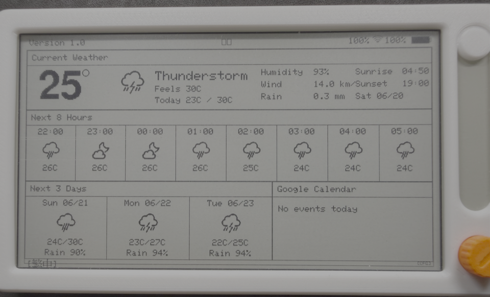

# PaperWeather-Calendar

Weather and calendar dashboard for the classic **M5Paper v1.1** e-ink kit (ESP32, 4.7", 960×540). It is **not** for M5PaperS3.

**English UI only.** The Chinese display language and on-screen language toggle from the Paper S3 fork are not included.



[](https://www.arduino.cc/)
[](https://platformio.org/)
[](https://docs.m5stack.com/en/core/m5paper)

## Features

- **Two dashboard faces**
  - **Face 0**: current weather, next 8 hours, next 3 days, and a calendar panel
  - **Face 1**: large clock + date, weather summary, and a larger calendar panel
- **Rotary face swap**: after a manual reset, within 30 seconds, rotate the side wheel up or down (`BtnA` / `BtnC`) to toggle faces; the choice is saved and reused on later wakes
- **Calendar panel mode** (both faces): **Month Calendar** (local Sunday-start grid; today = black cell with white number) or **Google Calendar** (today’s ICS events)
- **Web setup portal**: WiFi, location, calendar mode / ICS URL, temperature unit, refresh intervals, night mode
- **Onboard SHT30**: local temperature and humidity when the sensor is available (falls back to weather API values otherwise)
- **Power saving**: `M5.Power.timerSleep()` with separate day/night refresh intervals
- **Open-Meteo weather API**: no API key required

## Hardware Compatibility

| Device | Supported |
|--------|-----------|
| **M5Paper v1.1** (SKU K049-B, classic ESP32) | Yes |
| M5PaperS3 / other M5 boards | No |

Also required: USB-C for programming/power, and **2.4 GHz** WiFi (ESP32 has no 5 GHz).

Libraries: **M5Unified**, **M5GFX**, and **M5Unit-ENV** (onboard SHT30). Do not use the deprecated M5EPD library.

Product page: [M5Paper v1.1](https://shop.m5stack.com/products/m5paper-esp32-development-kit-v1-1-960x540-4-7-eink-display-235-ppi)

## Build and Flash (PlatformIO)

```bash
git clone <this-repo>
cd m5paperWeather-Calendar
pio run -e Paper
pio run -e Paper --target upload
pio device monitor --baud 115200
```

`platformio.ini` uses `board = m5stack-fire` with `-DARDUINO_M5STACK_Paper` because `m5stack-paper` is missing from many PlatformIO installs. Flash size is 16MB with PSRAM enabled. If your PlatformIO package includes `m5stack-paper`, you can switch `board` to that name.

## First Setup

1. After boot (or when WiFi is missing), connect to WiFi **`PaperWeather-Calendar`**, password **`configure`**.
2. Open `http://192.168.4.1`.
3. Enter WiFi, city (or coordinates), temperature unit, and refresh settings.
4. Under **Calendar Panel**, choose **Month Calendar** (default) or **Google Calendar**.
5. If Google Calendar is selected, paste an ICS URL (required for that mode only).
6. Click **Save & Restart**.

### Re-open configuration later

1. Press the **reset** button on the M5Paper.
2. Within **30 seconds**, tap **[CFG]** in the bottom-right corner of the screen.
3. Connect to the setup AP as above.

To leave the config portal without saving, rotate the side wheel **up** (`BtnA`).

## Dashboard Faces

After a **manual reset / power-on**, the device stays awake for 30 seconds:

- Tap **[CFG]** (bottom-right) to open setup.
- Rotate the side wheel **up or down** (`BtnA` / `BtnC`, GPIO37 / GPIO39) to toggle between Face 0 and Face 1.

The selected face is stored in Preferences and redrawn on the next weather refresh. The Face 1 clock is a **snapshot** at draw time (not a live ticking clock). Buttons are polled only during that post-reset window — not during deep sleep. While the config portal is open, `BtnA` only exits the portal (it does not change faces).

Automatic RTC wakes skip the 30-second wait: they fetch data, draw the saved face, and sleep again.

## Calendar Panel

- **Month Calendar** (default): current month as a Sunday-start grid (`S M T W T F S`). Out-of-month cells are blank. Today uses a black background with a white number. No ICS URL required.
- **Google Calendar**: up to three of today’s events from an ICS feed. An ICS URL is required; if missing in this mode, the setup portal opens after WiFi connects.

## Google Calendar ICS URL

1. Open Google Calendar → calendar settings → **Integrate calendar**.
2. Copy **Secret address in iCal format** (private) or the public iCal address.
3. Choose **Google Calendar** in the setup portal and paste the URL. It should contain `/calendar/ical/` and end with `/basic.ics`.

`HTTP 404` usually means the URL is not a valid accessible ICS feed.

## Power / Sleep Notes

- Sleep uses `M5.Power.timerSleep()` (RTC alarm + power off).
- **Full power-off / RTC wake works on battery.** When powered over USB, the device may not fully shut down (M5Paper power design).
- Validate overnight refresh cycles while running on battery.

## Attribution

Based on [Bastelschlumpf's M5PaperWeather](https://github.com/Bastelschlumpf/M5PaperWeather), later adapted for M5Paper S3, and ported here to classic **M5Paper v1.1** with M5Unified/M5GFX and an English-only UI.

## License

MIT License — see `LICENSE`.

## Acknowledgments

- [Bastelschlumpf](https://github.com/Bastelschlumpf) — original M5PaperWeather design
- [Open-Meteo](https://open-meteo.com/) — weather data
- [M5Stack](https://m5stack.com/) — M5Paper hardware and M5Unified / M5GFX
